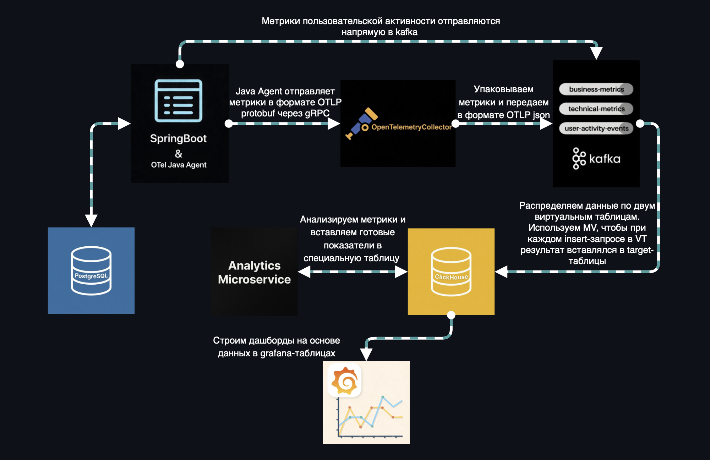
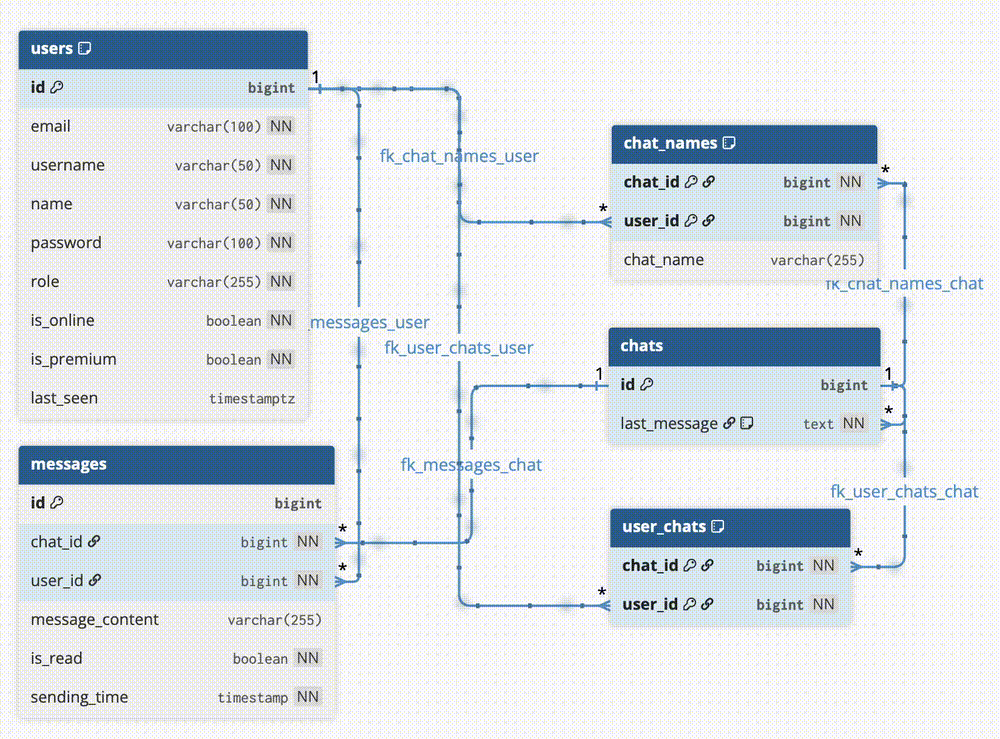
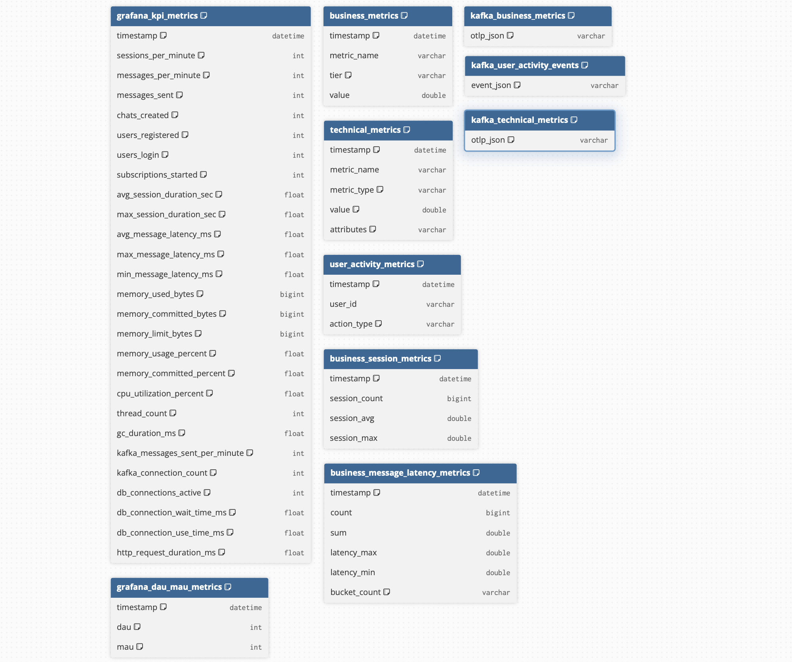
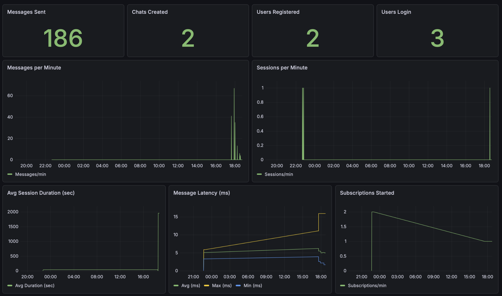
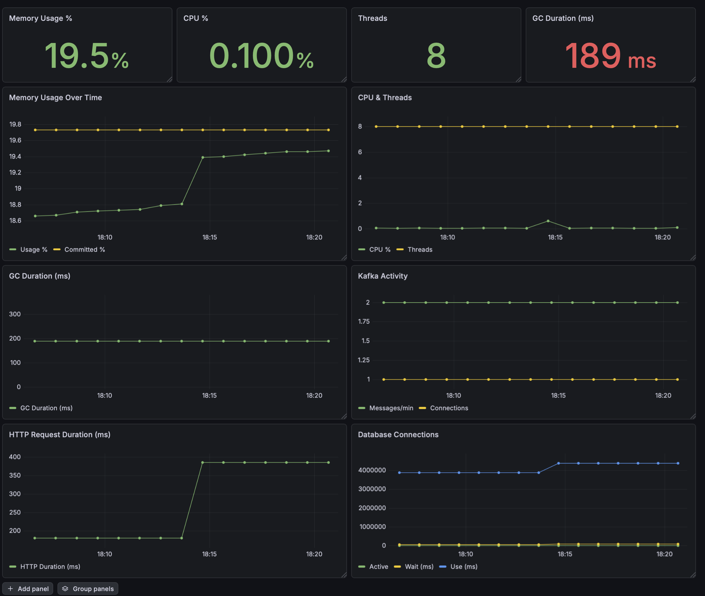
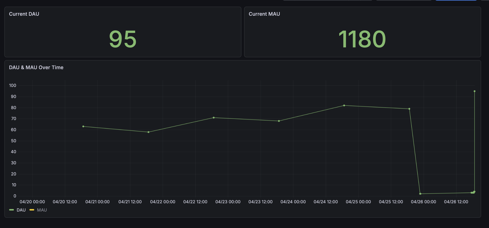
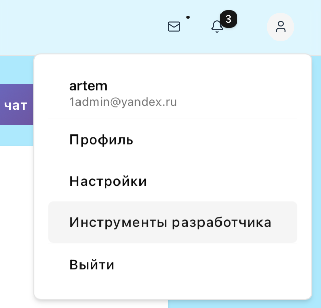

### Описание проекта 
****
Real-time мессенджер для общения на Spring Boot с полноценной observability-системой, включающей микросервис для аналитики на Python для анализа как бизнес-метрик, так и технических показателей(в сумме 28 метрик).

В проекте(backend) использованы следующие технологии и инструменты: 

Spring Boot, Hibernate, REST, WebSocket, Lombok, Micrometer, MeterRegistry, PostgreSQL, ClickHouse, ClickHouse kafka engine, Apache Kafka,
OpenTelemetry Java Agent, grafana, JUnit, Mockito, AssertJ
****
### Архитектура
****

****
### Демонстрация работы
****

****
### Схема базы данных PostgreSQL
****

****
### Схема базы данных ClickHouse
****

****
### Дашборды в Grafana
****

****

****

****
### Посмотреть дашборды в Grafana можно через меню:
****


### Запуск проекта
****
 Проект использует инструмент - just(https://just.systems) — удобный runner команд.
 * Для macOS
```bash 
  brew install just
 ```
* Запуск
```bash 
  just run
 ```
* UI
```bash
  just ui
```


